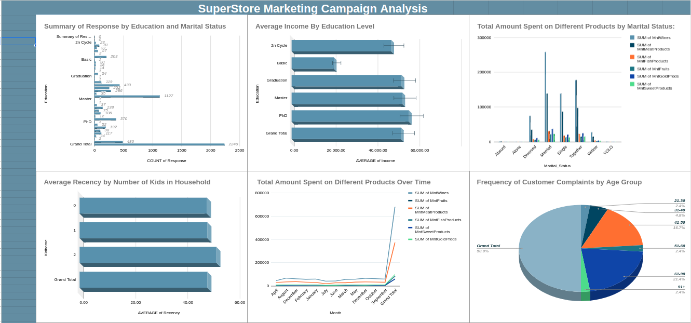

# Google Sheets Data Analysis and Visualization 📊

This repository contains data analysis and visualizations created using Google Sheets.




## Overview

🔍 This project focuses on analyzing customer data from a superstore marketing dataset and visualizing key insights using pivot tables and charts in sheets. The analysis includes  purchasing behavior, and product preferences.

## Formulas Used

🔢 Here are some of the Excel formulas used to calculate metrics and create visualizations:

```excel
=COUNTIF(range, criteria)  // Count occurrences based on a condition
=AVERAGE(range)            // Calculate the average of a range
=SUM(range)                // Sum values in a range
=MONTH(date)               // Extract the month from a date
```

## Visualizations

📈 The visualizations are organized in a separate worksheet named "Visualizations". Here are the types of visualizations included:

1. **Summary of Response by Education and Marital Status**: Stacked bar chart showing the distribution of responses by education and marital status.

2. **Average Income by Education Level**: Bar chart illustrating the average income for each education level.

3. **Total Amount Spent on Different Products by Marital Status**: Grouped bar chart comparing product spending by marital status.

4. **Average Recency by Number of Kids in Household**: Line chart showing recency of purchases by number of kids in the household.

5. **Frequency of Customer Complaints by Age Group**: Pie chart depicting the distribution of complaints across age groups.

6. **Total Amount Spent on Different Products Over Time**: Line chart showing product spending trends over time.

